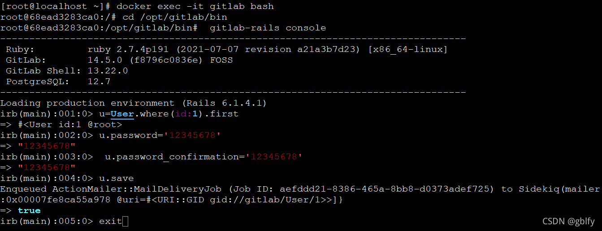

### docker 安装 gitlab

docker pull gitlab/gitlab-ce

#### docker 运行gitlab

#### linux

```
docker run -d --name gitlabce --restart always -p 9999:80 -p 4443:443 -p 222:22 -v /data/docker/gitlab/etc:/etc/gitlab -v /data/docker/gitlab/data:/var/opt/gitlab -v /data/docker/gitlab/log:/var/log/gitlab gitlab/gitlab-ce
```

#### win

```
docker run -d --name gitlabce --restart always -p 9999:80 -p 4443:443 -p 222:22 -v D:\SoftwareInstallation\docker\gitlab\etc:/etc/gitlab -v D:\SoftwareInstallation\docker\gitlab\data:/var/opt/gitlab -v D:\SoftwareInstallation\docker\gitlab\log:/var/log/gitlab gitlab/gitlab-ce
```

#### 修改root密码

  